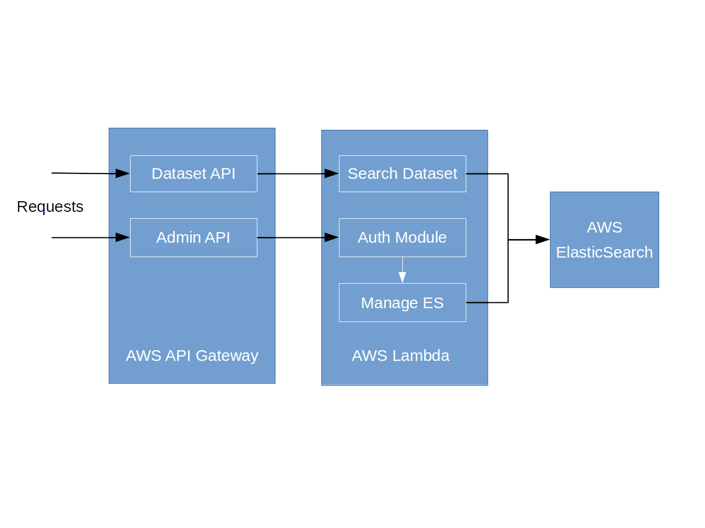

# SingularData API

This repository hosts the code for APIs used in the [SingularData](https://singulardata.github.io/).

The APIs are developed in [Node.js](https://nodejs.org/en/) and handled with [AWS Lambda](https://aws.amazon.com/lambda/). These APIs are used to preprocess and filter requests sent to the internal open data search engine (in the [AWS ElasticSearch service](https://aws.amazon.com/elasticsearch-service/)). They include:

* dataset API that sends search request to the ElasticSearch and returns an array of results

* admin API that manages the index of ElasticSearch. Authentication is required for this API and it is implemented as a lambda function.

The serverless architecture is used to reduce development effort, make quicker deployment, and lower the cost.

## Deployment

The API definition and lambda functions are managed with the [Serverless](https://github.com/serverless/serverless) framework. A [continous deployment pipeline](./travis.yml) is setup with [Travis CI](https://travis-ci.org) to deploy the code at every PR merge.

## License

MIT
